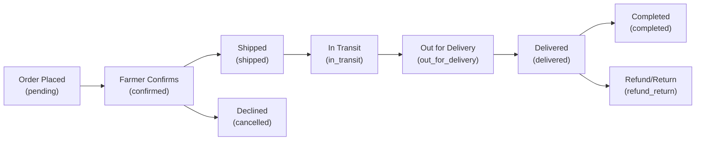

# Product Shipment Segment — Implementation Plan

## Background

AgroMarket currently has a complete order lifecycle: **Customer places order → Farmer confirms → Order completes**. However, there is **no shipment tracking** between confirmation and completion. The current order statuses are: `pending → to_receive → completed / cancelled / refund_return`.

This plan introduces a **Product Shipment** segment that gives both customers and farmers real-time visibility into delivery progress.

---

## User Review Required

> [!IMPORTANT]
> **New order status flow**: The shipment feature will introduce new statuses between `to_receive` and `completed`. The proposed flow is:
> `pending → confirmed → shipped → in_transit → out_for_delivery → delivered → completed`
> Please confirm if this granularity is acceptable, or if you prefer a simpler flow (e.g., `confirmed → shipped → delivered`).

> [!WARNING]
> **Database migration**: This plan adds a new `shipments` table and modifies the `orders` table to support shipment statuses. Existing orders with status `to_receive` will be migrated to `confirmed`.

---

## Proposed Architecture



---

## Proposed Changes

### Database Layer

#### [NEW] `api/shared/shipment-migrate.php`
- Auto-migration script (similar to `ensurePerishableProductSchema` pattern in `database.php`)
- Creates the `shipments` table:

```sql
CREATE TABLE IF NOT EXISTS shipments (
    id INT AUTO_INCREMENT PRIMARY KEY,
    order_id INT NOT NULL,
    tracking_code VARCHAR(50) UNIQUE,
    carrier_name VARCHAR(100) DEFAULT 'AgroMarket Delivery',
    status ENUM('preparing','shipped','in_transit','out_for_delivery','delivered') DEFAULT 'preparing',
    estimated_delivery DATE NULL,
    shipped_at DATETIME NULL,
    delivered_at DATETIME NULL,
    current_location VARCHAR(255) NULL,
    notes TEXT NULL,
    created_at DATETIME DEFAULT CURRENT_TIMESTAMP,
    updated_at DATETIME DEFAULT CURRENT_TIMESTAMP ON UPDATE CURRENT_TIMESTAMP,
    FOREIGN KEY (order_id) REFERENCES orders(id) ON DELETE CASCADE
);
```

- Creates `shipment_events` table for tracking history:

```sql
CREATE TABLE IF NOT EXISTS shipment_events (
    id INT AUTO_INCREMENT PRIMARY KEY,
    shipment_id INT NOT NULL,
    status VARCHAR(50) NOT NULL,
    location VARCHAR(255) NULL,
    description VARCHAR(500) NULL,
    event_at DATETIME DEFAULT CURRENT_TIMESTAMP,
    FOREIGN KEY (shipment_id) REFERENCES shipments(id) ON DELETE CASCADE
);
```

#### [MODIFY] [database.php](file:///c:/xampp/htdocs/Salman_Web_Project/config/database.php)
- Call the shipment migration function on load (same auto-migration pattern already used)

---

### Farmer Side — Shipment Management

#### [NEW] `api/farmer/farmer-shipment-action.php`
Backend API for farmers to:
- **Create shipment** when confirming an order (auto-generates tracking code)
- **Update shipment status** (shipped → in_transit → out_for_delivery → delivered)
- **Update location/notes** at each stage
- **Set estimated delivery date**

#### [MODIFY] [farmer-orders.html](file:///c:/xampp/htdocs/Salman_Web_Project/pages/farmer/farmer-orders.html)
- Add a "Shipment" column to the orders list showing shipment status badges
- Add filter for shipment-specific statuses

#### [NEW] `pages/farmer/farmer-shipment.html`
Dedicated shipment management page for farmers with:
- **Order details card** (product, customer info, address)
- **Shipment status stepper** (visual progress bar)
- **Update form** to change status, add location, notes
- **Shipment history timeline** showing all events

#### [NEW] `assets/css/farmer-shipment.css`
Dedicated CSS for the farmer shipment management page

---

### Customer Side — Shipment Tracking

#### [NEW] `api/customer/customer-shipment-data.php`
Backend API for customers to:
- **Get shipment details** for an order (status, tracking code, carrier, estimated delivery)
- **Get shipment event history** (timeline of status changes with locations)

#### [NEW] `pages/customer/customer-shipment.html`
Dedicated shipment tracking page for customers with:
- **Tracking header** with tracking code and carrier info
- **Visual stepper/progress bar** showing shipment progress through stages
- **Estimated delivery date** with countdown
- **Live shipment timeline** (event history with locations and timestamps)
- **Order details summary** (product info, farmer info)

#### [NEW] `assets/css/customer-shipment.css`
Dedicated CSS for the customer shipment tracking page

#### [MODIFY] [customer-orders.html](file:///c:/xampp/htdocs/Salman_Web_Project/pages/customer/customer-orders.html)
- Add a "Track" button/link on each order row that navigates to the shipment tracking page
- Add `shipped` status pill/badge to the summary bar
- Add `shipped` filter chip

---

### Sidebar Navigation Updates

#### [MODIFY] [customer-account.html](file:///c:/xampp/htdocs/Salman_Web_Project/pages/customer/customer-account.html)
- Add "Shipments" link to the sidebar navigation

#### [MODIFY] [farmer-orders.html](file:///c:/xampp/htdocs/Salman_Web_Project/pages/farmer/farmer-orders.html)
- Update order rows to include "Manage Shipment" link/button

---

### Updated Order Action Flow

#### [MODIFY] [farmer-order-action.php](file:///c:/xampp/htdocs/Salman_Web_Project/api/farmer/farmer-order-action.php)
- When farmer **confirms** an order → auto-create a shipment record with status `preparing`
- When farmer changes shipment to **delivered** → auto-update order status to `completed`

---

## UI Design Concept

### Customer Shipment Tracking Page
```
┌──────────────────────────────────────────────────┐
│  🚚 Shipment Tracking                           │
│  Tracking: TRK-2604211234AB  •  AgroMarket      │
├──────────────────────────────────────────────────┤
│                                                  │
│  ●━━━━━●━━━━━●━━━━━○━━━━━○━━━━━○                │
│  Prep  Ship  Transit  Out     Deliver            │
│                                                  │
│  📅 Estimated Delivery: Apr 25, 2026             │
├──────────────────────────────────────────────────┤
│  📋 Shipment Timeline                            │
│                                                  │
│  ● Apr 21, 8:30 PM — In Transit                  │
│  │  📍 Dhaka Sorting Hub                         │
│  │  Package scanned at sorting facility           │
│  │                                               │
│  ● Apr 21, 2:00 PM — Shipped                     │
│  │  📍 Farmer's Location                         │
│  │  Package picked up by carrier                  │
│  │                                               │
│  ● Apr 21, 10:00 AM — Preparing                  │
│     📍 Farm                                      │
│     Order confirmed, preparing package            │
├──────────────────────────────────────────────────┤
│  📦 Order Details                                │
│  Product: Organic Tomatoes (5kg)                  │
│  Farmer: Green Valley Farm                        │
│  Total: ৳850.00                                  │
└──────────────────────────────────────────────────┘
```

### Farmer Shipment Management Page
```
┌──────────────────────────────────────────────────┐
│  📦 Manage Shipment                              │
│  Order: #ORD2604211234AB                         │
├──────────────────────────────────────────────────┤
│                                                  │
│  Current Status: [Shipped ▾]                     │
│  Location:       [___________________]           │
│  Notes:          [___________________]           │
│  Est. Delivery:  [2026-04-25]                    │
│                                                  │
│  [Update Shipment Status]                        │
├──────────────────────────────────────────────────┤
│  📋 Shipment History                             │
│  (same timeline as customer view)                │
└──────────────────────────────────────────────────┘
```

---

## Summary of New & Modified Files

| File | Action | Description |
|------|--------|-------------|
| `api/shared/shipment-migrate.php` | **NEW** | DB migration for shipments tables |
| `config/database.php` | **MODIFY** | Call shipment migration |
| `api/farmer/farmer-shipment-action.php` | **NEW** | Farmer shipment CRUD API |
| `api/customer/customer-shipment-data.php` | **NEW** | Customer shipment read API |
| `pages/farmer/farmer-shipment.html` | **NEW** | Farmer shipment management page |
| `pages/customer/customer-shipment.html` | **NEW** | Customer shipment tracking page |
| `assets/css/farmer-shipment.css` | **NEW** | Farmer shipment page styles |
| `assets/css/customer-shipment.css` | **NEW** | Customer shipment tracking styles |
| `api/farmer/farmer-order-action.php` | **MODIFY** | Auto-create shipment on confirm |
| `pages/customer/customer-orders.html` | **MODIFY** | Add "Track" button to orders |
| `pages/farmer/farmer-orders.html` | **MODIFY** | Add shipment status + manage link |
| `pages/customer/customer-account.html` | **MODIFY** | Add "Shipments" sidebar link |

---

## Open Questions

> [!IMPORTANT]
> 1. **Status granularity**: Do you want all 5 shipment stages (`preparing → shipped → in_transit → out_for_delivery → delivered`), or would a simpler 3-stage flow (`preparing → shipped → delivered`) be sufficient?

> [!IMPORTANT]
> 2. **Carrier info**: Should the farmer be able to enter a custom carrier name and external tracking number (e.g., for third-party logistics), or is `AgroMarket Delivery` the only carrier?

> [!NOTE]
> 3. **Notifications**: Should the customer receive notifications when shipment status changes? (This could integrate with the existing notification system from a previous conversation.)

---

## Verification Plan

### Automated Tests
- Verify DB migration runs without errors on fresh database
- Test farmer shipment API endpoints (create, update status, get details)
- Test customer shipment data API (read tracking info, timeline)
- Verify order status transitions work correctly with shipment integration

### Manual Verification
- Place an order as customer → Confirm as farmer → Verify shipment auto-created
- Update shipment status through all stages → Verify customer tracking page updates
- Check visual stepper renders correctly at each stage
- Test sidebar navigation links on both customer and farmer sides
- Verify responsive design on mobile viewports
